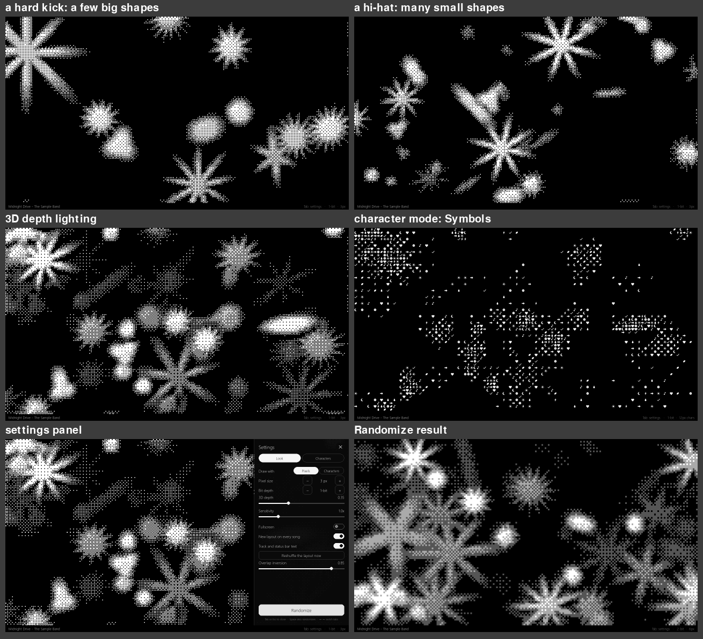

# visualizer

A black & white audio visualizer for whatever is playing on your computer, with a
settings panel (and a Randomize button) so you can change almost everything about
how it looks. It's pure code: no images, just the music drawn as something that
looks three-dimensional.

- **Shapes that follow the frequencies.** Every frequency owns a few random spots,
  and a spot only lights up when *its* frequency is loud for *that* band -- so a
  hi-hat lights its shapes as readily as a kick lights its own. Bass draws a few big,
  slow shapes (a kick is a handful of large shapes, never the whole screen), treble
  draws many small quick ones. The shapes are a smooth **orb**, a **spiky orb**, a
  long-spiked **star**, an ambiguous lumpy **blob**, and a small share of long thin
  **slashes**; all of them spin. **Every new song draws a brand new random layout.**
- **Everything inverts where it overlaps.** Where shapes cross, the pixels invert
  like a negative: white goes black, gray flips, black shows white.
- **3D depth.** The picture is lit like an embossed relief (highlights on edges
  facing the light, shadows on the far side), so a flat dither reads as a surface
  with depth. A slider sets how strong.
- **Pixels or characters.** Draw with dithered pixels, or with characters chosen
  from four sets you can mix: **Shapes**, **Symbols** (hearts, arrows, checks,
  flowers, moons, suns, bolts, notes...), **ASCII** and **Binary 0/1**. Each cell
  gets a random glyph, or one picked by brightness like classic ASCII art.
  Brightness sets how bright and how big each glyph is, so bit depth still applies.
- **Randomize.** One button that shuffles the whole look until you find one you like.
- **Session only.** Nothing is saved; every launch starts from the defaults.



## Get it running

**Easiest -- download the app** from the
[Releases page](../../releases/latest):

| OS | File | Notes |
|----|------|-------|
| Windows | `AudioVisualizer-windows.exe` | Double-click. Captures system audio directly (no cables). SmartScreen may warn because the app is unsigned: *More info -> Run anyway*. |
| macOS (Apple silicon) | `AudioVisualizer-mac.zip` | Unzip, then right-click the app -> *Open* the first time. macOS has no built-in loopback, so it listens to the default input (microphone), or to a virtual device like BlackHole if installed. |

**From source, one double-click** (installs Python packages for you on first run):

- Windows: double-click `Run-Windows.bat`
- macOS: double-click `Run-Mac.command`

Or by hand: `pip install -e .` then `python -m visualizer.main`
(add `--demo` for a built-in test tone, `--fullscreen` to start fullscreen).

## Using it

It opens as a normal window (minimize / maximize / **X**). It stays open when you
click into other apps or other monitors and only closes when you close it.

**Press `Tab` (or click the status bar) for settings.** Two tabs, no scrolling:

- *Look*: pixels or characters, pixel / character size, bit depth, 3D depth,
  overlap inversion, sensitivity, fullscreen, new layout on every song, status text
- *Characters*: which sets to use (Shapes / Symbols / ASCII / Binary), random or
  by-brightness, character size

The **Randomize** button is always at the bottom of the panel.

| Key | Effect |
|-----|--------|
| `Tab` | Open / close the settings panel (`Esc` closes it; `Left` / `Right` switch tabs) |
| `Space` | Randomize the whole look |
| `C` | Switch between pixels and characters |
| `Up` / `Down` | Tighter / looser cells (pixels: 2-12 px; characters: 6-40 px) |
| `B` | Cycle bit depth (1 / 2 / 3 / 4 -> 2 / 4 / 8 / 16 gray levels) |
| `F` / `F11` | Toggle fullscreen (`Esc` leaves fullscreen; it never closes the app) |
| `R` | Reshuffle to a new random layout right now |
| `M` | Toggle mode: frequency field / waveform |
| `N` | Toggle the now-playing + display text |

On very large screens the pixel grid is coarsened automatically to keep the frame
rate up.

## How it works

```
audio_capture.py    WASAPI loopback (Windows), input device (macOS/Linux), or a synthetic test tone
analyzer.py         FFT -> 96 log-spaced frequency energies with attack/decay smoothing
spectral_field.py   Per-band-normalised shapes: grouped big bass shapes, many small treble ones, area budget
relief.py           Relief lighting that makes the picture read as 3D
glyphs.py           Character mode: glyph atlas (Shapes / Symbols / ASCII / Binary), random or by-brightness
randomizer.py       The Randomize button
settings_ui.py      In-window tabbed settings panel
palette.py          Black/white quantization + ordered (Bayer) dithering
renderer.py         Pixel path (nearest-neighbor upscale), character path, slim system-font status bar
now_playing.py      Current track from Windows media controls (winrt), used to spot song changes
window_style.py     Black title bar (Windows 11)
config.py           Session settings (never saved)
main.py             Resizable window, event loop
```

Each frequency band is compared with *its own* recent peak, ranked (weighted by
real energy, so a kick's broadband click can't outrank the bass), capped to a
fraction of the bands, and limited by a per-frame area budget -- that is what keeps
a hard bass hit from lighting the whole screen while still letting a hi-hat show.

A new song is detected from the OS now-playing info (Windows) or, where that isn't
available, from music resuming after a silent gap.

## Development

```
pip install -e ".[dev]"
pytest tests/
python tools/render_samples.py out/            # headless screenshots of every look
python -m PyInstaller --onefile --windowed --name AudioVisualizer --collect-submodules winrt --collect-all pyaudiowpatch --paths src packaging/entry.py
```

Pushing a tag like `v0.2.0` makes GitHub Actions build the Windows and macOS apps
and attach them to a release (`.github/workflows/build.yml`).

## Known limitations

- Real system-audio capture and track names are Windows-only; the macOS build
  hears audio through an input device and shows no track name. The macOS and
  Linux paths are untested on real hardware.
- Character mode is black and white, drawn from the four built-in sets (no custom
  fonts or typed text).
- The black title bar needs Windows 11; Windows 10 gets a dark one, other
  platforms keep their normal title bar.
- The Windows exe is unsigned, so SmartScreen shows a warning on first run.
- Desktop only for now: a browser version (for hosting online) is a separate future step.
